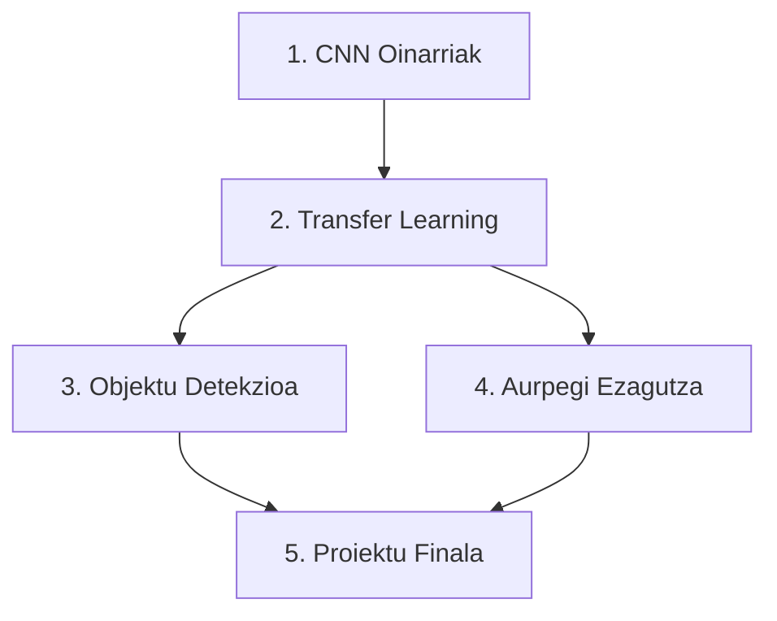

# 🚀 Deep Computer Vision - Proiektuak Eskutik

[](https://www.python.org/)
[](https://www.tensorflow.org/)
[](https://creativecommons.org/licenses/by-nc-sa/4.0/)

Maila aurreratuko Computer Vision proiektuak - Jupyter Notebooks with CNN, Transfer Learning, YOLO, eta Face Recognition

---

## 📖 Deskribapena

Baliabide hau **2.B ATAZA**ren parte da (Ezagutzan Sakontzeko Eduki Digitala) eta **maila aurreratuko ikasleentzat** diseinatuta dago. Aurre-ebaluazioan **8-10 puntu** lortu dutenek eduki hau erabiliko dute.

**Helburua**: Deep Learning eta CNN teknikak erabiliz Computer Vision proiektu konplexuak garatzea.

---

## 🎯 Ikaskuntza Helburuak

### Kontzeptualak:
- ✅ CNN (Convolutional Neural Networks) arkitektura ulertu
- ✅ Deep Learning funtsak Computer Vision-en
- ✅ Transfer Learning kontzeptua ezagutu
- ✅ Eredu ezagunenak identifikatu (ResNet, YOLO, VGG16)

### Prozeduralak:
- ✅ CNN eredua diseinatu eta entrenatu
- ✅ Pre-trained ereduak erabili (Transfer Learning)
- ✅ Objektu-detekzioa inplementatu (YOLO)
- ✅ Aurpegi-ezagutza sisteman garatu
- ✅ Accuracy, Precision, Recall metrikak kalkulatu

### Jarrerazkoak:
- ✅ Arazo konplexuen aurrean erabakitasuna
- ✅ Esperimentazioa eta proba-errorea
- ✅ Kode etikoa IA-ren garapenean

---

## 📁 Egitura

```
Deep_Computer_Vision_Proiektuak/
│
├── README.md                        # Dokumentu hau
├── requirements.txt                 # Python dependentziak
├── LICENSE                          # CC BY-NC-SA 4.0
│
├── 01_CNN_Oinarriak/               # CNN sarrera
│   ├── 01_CNN_Sarrera.ipynb
│   ├── 02_Lehen_CNN_Eredua.ipynb
│   └── datuak/
│
├── 02_Transfer_Learning/           # Transfer Learning
│   ├── 03_ResNet_Transfer_Learning.ipynb
│   ├── 04_VGG16_Fine_Tuning.ipynb
│   └── ereduak/
│
├── 03_Objektu_Detekzioa/          # YOLO objektu-detekzioa
│   ├── 05_YOLO_Sarrera.ipynb
│   ├── 06_Objektu_Detekzio_Proiektua.ipynb
│   └── test_irudiak/
│
├── 04_Aurpegi_Ezagutza/           # Face Recognition
│   ├── 07_Face_Recognition.ipynb
│   ├── 08_Emotion_Detection.ipynb
│   └── aurpegiak/
│
└── 05_Proiektu_Finala/            # Proiektu konplexua
    ├── 09_Proiektu_Osoa.ipynb
    ├── utils.py
    └── emaitzak/
```

---

## 📓 Jupyter Notebooks Zerrenda (9 Notebook)

### 1️⃣ CNN Oinarriak
- **[01_CNN_Sarrera.ipynb](01_CNN_Oinarriak/01_CNN_Sarrera.ipynb)**: CNN vs MLP, konboluzioa, pooling, feature maps
- **[02_Lehen_CNN_Eredua.ipynb](01_CNN_Oinarriak/02_Lehen_CNN_Eredua.ipynb)**: MNIST dataset-arekin CNN eredua (callbacks, confusion matrix)

### 2️⃣ Transfer Learning
- **[01_Transfer_Learning_Sarrera.ipynb](02_Transfer_Learning/01_Transfer_Learning_Sarrera.ipynb)**: VGG16, ResNet50, MobileNetV2 konparazioa
- **[02_Cats_vs_Dogs_Klasifikazioa.ipynb](02_Transfer_Learning/02_Cats_vs_Dogs_Klasifikazioa.ipynb)**: Feature Extraction vs Fine-Tuning (25,000 irudi)

### 3️⃣ Objektu Detekzioa
- **[01_Objektu_Detekzioa_Sarrera.ipynb](03_Objektu_Detekzioa/01_Objektu_Detekzioa_Sarrera.ipynb)**: Bounding boxes, IoU, NMS, YOLO arkitektura
- **[02_YOLO_Praktika.ipynb](03_Objektu_Detekzioa/02_YOLO_Praktika.ipynb)**: YOLOv8 praktika, denbora errealeko detekzioa, 80 klase (COCO)

### 4️⃣ Aurpegi Ezagutza
- **[01_Aurpegi_Ezagutza_Sarrera.ipynb](04_Aurpegi_Ezagutza/01_Aurpegi_Ezagutza_Sarrera.ipynb)**: Face Detection vs Recognition, 128D embeddings, triplet loss
- **[02_Face_Recognition_Praktika.ipynb](04_Aurpegi_Ezagutza/02_Face_Recognition_Praktika.ipynb)**: face_recognition liburutegia, 68 landmarks, webcam

### 5️⃣ Proiektu Finala
- **[01_Proiektu_Finala_CIFAR10.ipynb](05_Proiektu_Finala/01_Proiektu_Finala_CIFAR10.ipynb)**: CIFAR-10 proiektu konplexua (60,000 irudi, 10 klase, custom CNN)

---

## 🚀 Nola Erabili

### 1. Klonatu Repositorioa
```bash
git clone https://github.com/maldalur/Deep_Computer_Vision_Proiektuak.git
cd Deep_Computer_Vision_Proiektuak
```

### 2. Instalatu Dependentziak
```bash
pip install -r requirements.txt
```

### 3. Ireki Jupyter Notebook
```bash
jupyter notebook
```

### 4. Google Colab-en Exekutatu (GPU-rekin)
Notebook bakoitzaren goiko aldean "Open in Colab" botoia sakatu

[](https://colab.research.google.com/github/maldalur/B1_portfolio_digitala)

---

## 📊 PowerPoint Aurkezpena

Proiektu osoaren aurkezpen bat sortu da 12 diapositibarekin:

**🔗 Estekak:**
- 📊 [Ikusi Google Drive-n](https://docs.google.com/presentation/d/1mWXg933T77FoVqETz7BqCbqY_9r3HJeA/edit?usp=sharing&ouid=115862801143979037014&rtpof=true&sd=true)
- 📥 [Deskargatu PPT](Deep_Computer_Vision_Aurkezpena.pptx)

**Edukia:**
- Ikastaroaren aurkezpena eta helburuak
- 5 atal nagusien deskribapena
- Teknologiak eta tresnak
- Lorpen esperatuak
- Hurrengo pausoak

---

## 📦 Dependentziak

### Liburutegi Nagusiak:
- **Python 3.8+**: Programazio lengoaia
- **TensorFlow 2.0+ & Keras**: Deep Learning framework-a
- **OpenCV (cv2)**: Irudien prozesatzea eta kamera
- **NumPy & Pandas**: Datu manipulazioa
- **Matplotlib & Seaborn**: Bisualizazioa
- **scikit-learn**: Metrikak eta preprocessing
- **Pillow (PIL)**: Irudi manipulazioa
- **Ultralytics (YOLOv8)**: Objektu detekzioa
- **face_recognition & dlib**: Aurpegi ezagutza

### Eredu Aurreentrenatuen:
- **VGG16**: 138M parametro (ImageNet)
- **ResNet50**: 25.6M parametro (ImageNet)
- **MobileNetV2**: 3.5M parametro (mugikorretarako)
- **YOLOv8**: COCO dataset-arekin (80 klase)

Ikusi `requirements.txt` zerrenda osoa ikusteko.

---

## 📊 Dataset-ak

Proiektu hauek dataset ezberdinak erabiltzen dituzte:

1. **MNIST**: 70,000 eskuz idatzitako digitu (28x28 pixel, 10 klase)
2. **CIFAR-10**: 60,000 irudi koloretsuak (32x32 pixel, 10 klase: airplanes, cars, birds, etc.)
3. **Dogs vs Cats**: 25,000 irudi (Transfer Learning praktikak)
4. **ImageNet**: 14M+ irudi (1000 klase, pre-trained ereduetarako)
5. **COCO**: 330K irudi (80 kategoria, objektu-detekziorako)
6. **LFW (Labeled Faces in the Wild)**: 13,000 aurpegi irudi

Dataset guztiak automatikoki deskargatzen dira notebook-etan edo TensorFlow/Keras datasets erabiliz.

---

## 🎓 Proiektuaren Fluxua



**Gomendatutako ordena**: 01 → 02 → 03 → 04 → ... → 09

---

## 💡 Gako Kontzeptuak

### CNN (Convolutional Neural Networks)
Sare neuronalak irudiak prozesatzeko diseinatuak:
- **Konboluzio geruza**: Karakteristikak atera (ertzak, testurak)
- **Pooling geruza**: Dimentsioa murriztu
- **Fully Connected geruza**: Klasifikazioa

### Transfer Learning
Pre-trained eredu bat hartu eta dataset berrira egokitu:
- **Fine-tuning**: Geruza batzuk berriz entrenatu
- **Feature extraction**: Geruza geldituak erabili

### YOLO (You Only Look Once)
Objektu-detekzio errealean denbora errealean:
- Irudi osoa behin bakarrik prozesatu
- Azkarragoa R-CNN baino
- Objektuak eta bounding box-ak detektatu

---

## 🔧 Troubleshooting

### GPU ez dago erabilgarri?
```python
import tensorflow as tf
print("GPU erabilgarri:", tf.config.list_physical_devices('GPU'))
```

Google Colab erabili GPU doako baterako.

### Memoria arazoak?
Batch size-a murriztu:
```python
model.fit(X_train, y_train, batch_size=16)  # 32 edo 64 ordez
```

### Dataset ez da deskargatu?
Manualki deskargatu eta `datuak/` karpetan jarri.

---

## 📝 Lizenzia

Creative Commons Attribution-NonCommercial-ShareAlike 4.0 International (CC BY-NC-SA 4.0)

- ✅ Partekatu eta moldatu
- ✅ Aipamena eman
- ❌ Ez komertziala
- ✅ Lizentzia berbera mantendu

---

## 👤 Egilea

**Mikel Aldalur Corta**  
Irakaslea - Instituto de Formación Profesional BIRT  
📧 maldalur@birt.eus  
🌐 [Portfolio Digitala](https://maldalur.github.io/B1_portfolio_digitala/)  
🐙 [GitHub](https://github.com/maldalur/B1_portfolio_digitala)

---

## 🔗 Esteka Erabilgarriak

- 🌐 [Portfolio Online](https://maldalur.github.io/B1_portfolio_digitala/)
- 📊 [PowerPoint Aurkezpena (Google Drive)](https://docs.google.com/presentation/d/1mWXg933T77FoVqETz7BqCbqY_9r3HJeA/edit?usp=sharing&ouid=115862801143979037014&rtpof=true&sd=true)
- 🐙 [GitHub Repository](https://github.com/maldalur/B1_portfolio_digitala/tree/main/Deep_Computer_Vision_Proiektuak)
- 📓 [Jupyter Notebooks](https://github.com/maldalur/B1_portfolio_digitala/tree/main/Deep_Computer_Vision_Proiektuak)

---

## 🌟 Eskerrak

Dataset-ak eta ereduak:
- TensorFlow & Keras
- PyTorch
- Ultralytics (YOLO)
- OpenCV
- face_recognition liburutegia

---

## 📚 Erreferentziak

1. **LeCun et al. (1998)** - Gradient-Based Learning Applied to Document Recognition
2. **Krizhevsky et al. (2012)** - ImageNet Classification with Deep CNNs
3. **He et al. (2015)** - Deep Residual Learning for Image Recognition
4. **Redmon et al. (2016)** - You Only Look Once: Unified, Real-Time Object Detection
5. **Schroff et al. (2015)** - FaceNet: A Unified Embedding for Face Recognition

---

## 🚀 Hurrengo Pausuak

Proiektu hauek osatu ondoren:
1. ✅ Zure dataset propioa erabili
2. ✅ Eredua produkziora eraman (Flask API)
3. ✅ Eredua optimizatu (TensorFlow Lite)
4. ✅ Cloud-era deploy egin (AWS, Google Cloud)

---

**Zorionak! Prest zaude Computer Vision proiektu aurreratuak garatzen hasteko! 🎉**
